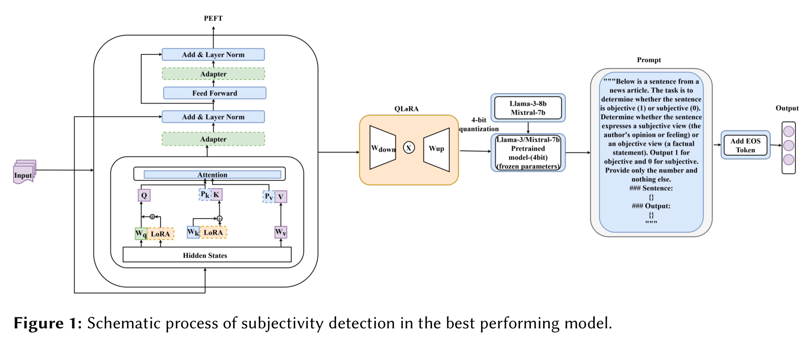
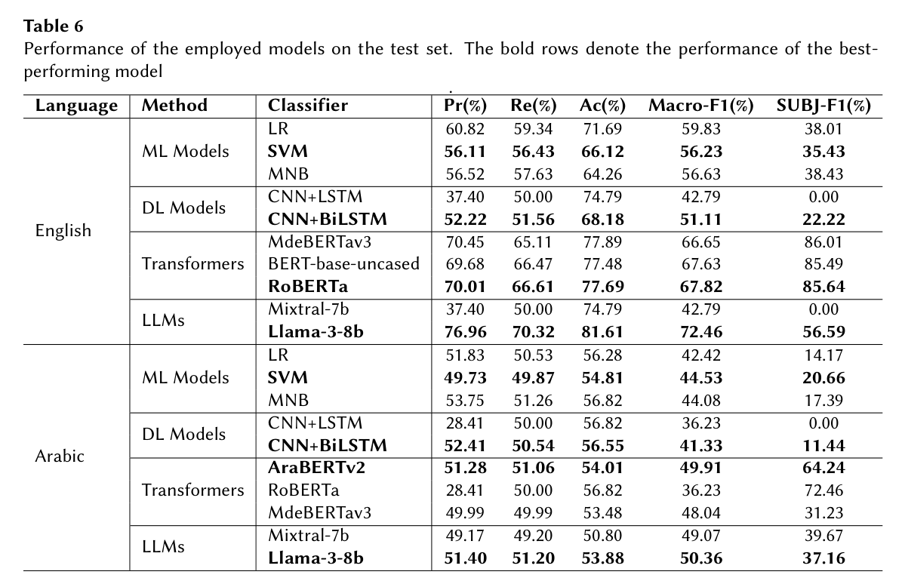

# SemanticCuetSync-at-CheckThat-2024-finding-subjectivity-in-news-article-using-Llama
SemanticCuetSync at CheckThat! 2024

This study introduces an LLM-based technique for detecting subjectivity and objectivity in English and Arabic
news articles. Although several transformers, deep learning (DL), and machine learning (ML)- based techniques
were exploited for the task, the LLM (Llama-3-8b) outperformed other models, obtaining the highest F1-scores
of 72.6% (Arabic) and 50.36% (English). The suggested LLM-based solution provides a rank of 4th (Arabic) and
12th (English) in the task competition. The research emphasizes the potential of advanced LLMs like Llama-3-8b
in achieving high subjectivity and objectivity detection accuracy, which is essential for applications in media
analysis, sentiment analysis, and automated content moderation. This study contributes to developing robust
multilingual text classification systems, paving the way for more sophisticated and accurate linguistic analysis
tools.

# Cite
@article{paran2024semanticcuetsync,
  title={SemanticCuetSync at CheckThat! 2024: finding subjectivity in news article using Llama},
  author={Paran, Ashraful Islam and Hossain, Md Sajjad and Shohan, Symom Hossain and Hossain, Jawad and Ahsan, Shawly and Hoque, Mohammed Moshiul},
  year={2024}
}

# Methodology

# Results

# Definition
Systems are challenged to distinguish whether a sentence from a news article expresses the subjective view of the author behind it or presents an objective view on the covered topic instead.

This is a binary classification tasks in which systems have to identify whether a text sequence (a sentence or a paragraph) is subjective or objective.

The task is offered in five languages: Arabic, Bulgarian, English, German and Italian, plus Multilingual.